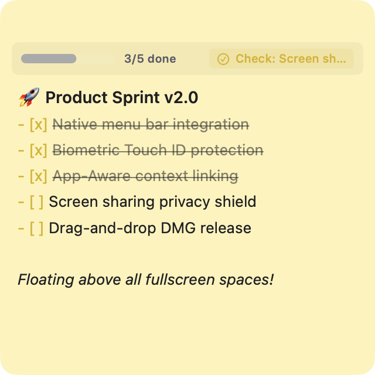
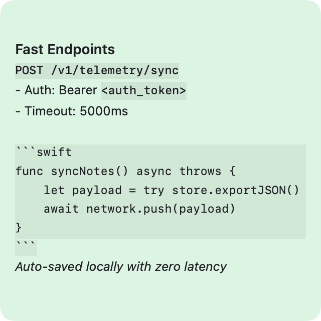
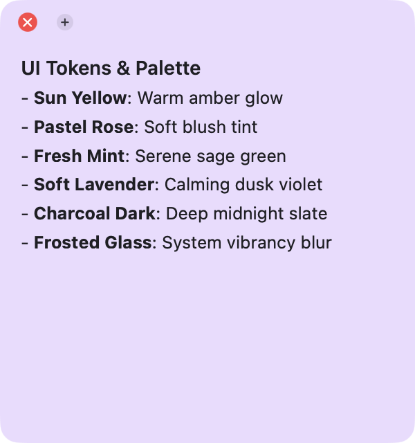
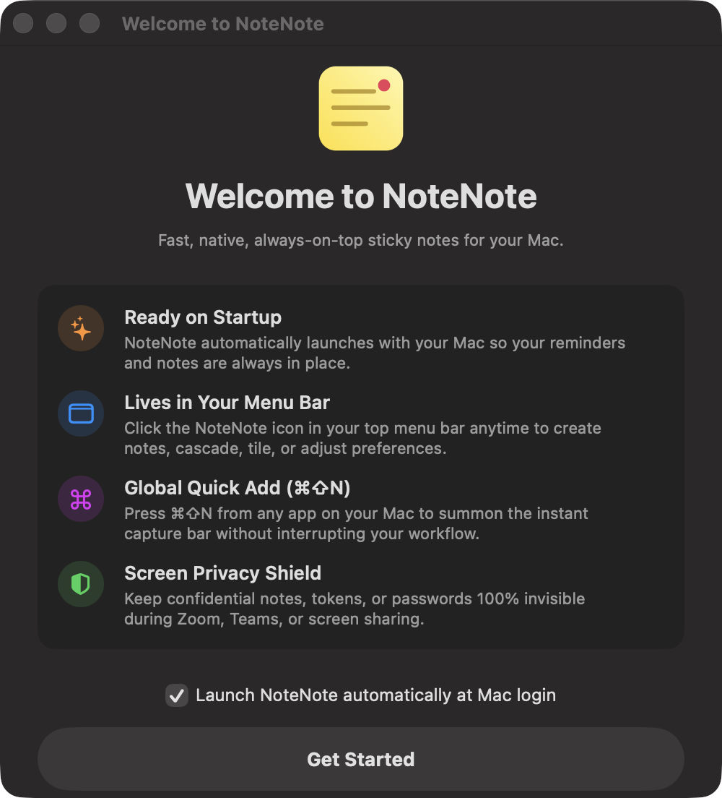
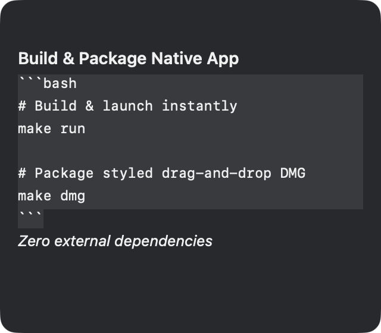

# NoteNote2 — Lightweight, Local-First Sticky Notes App for macOS

[](https://www.apple.com/macos/)
[](https://swift.org)
[](LICENSE)
[](https://github.com/pritesh-ranjan/NoteNote2/actions)
[](https://github.com/pritesh-ranjan/NoteNote2/stargazers)
[](https://github.com/pritesh-ranjan/NoteNote2/releases/latest)

**NoteNote2** is a free, open-source, privacy-focused sticky notes application for macOS built entirely with **Swift**, **SwiftUI**, and **AppKit**. It's designed for developers, designers, and power users who need distraction-free, always-on-top floating notes without the overhead of Electron or cloud sync. Notes are stored 100% locally on your Mac — no account, no telemetry, no internet required.

NoteNote2 lives in your **menu bar** with zero Dock clutter, floats above fullscreen apps, links notes to specific Mac apps, docks to screen edges, renders **live Markdown with interactive checklists**, and hides private notes from screen shares, Zoom calls, and screen recordings using native macOS privacy APIs.

<p align="center">
  
</p>

---

## Download & Install

**Ready-to-use DMG — no Xcode or build tools required:**

<p align="center">
  <a href="https://github.com/pritesh-ranjan/NoteNote2/releases/download/v1.2.0/NoteNote.dmg">
    
  </a>
</p>

1. Download **[NoteNote.dmg](https://github.com/pritesh-ranjan/NoteNote2/releases/download/v1.2.0/NoteNote.dmg)**
2. Open the DMG and drag `NoteNote.app` to your **Applications** folder
3. Launch NoteNote — it appears in your **menu bar** (not the Dock)

> **Requires macOS Sonoma 14.0 or later.**

---

## Key Features

- 📌 **Always on Top (Survives Fullscreen Apps)** — Floats above your workspace even when apps like Xcode, VS Code, Figma, or Safari enter fullscreen (`.floating` + `.canJoinAllSpaces`, `.fullScreenAuxiliary`).
- 🔗 **App-Aware Notes (Context-Linked)** — Link a note to any Mac app (e.g. Figma, Slack, Safari) directly from the note header 🔗 icon or right-click context menu. The note appears automatically when that app becomes active and hides when you switch away — without stealing focus.
- 🛡️ **Screen Sharing Privacy Shield** — One-click privacy shield using AppKit's `window.sharingType = .none` (toggleable via the note header 🛡️ icon or right-click menu). Provides best-effort window-level exclusion from legacy window capture and screen sharing while remaining visible to you on screen.
- ⭲ **Edge Dock (Slide-Out Notes)** — Dock any note to the left or right display edge as a sleek, compact handle. Hover or click to reveal it smoothly.
- ⚡ **Spotlight-Style Quick Add (`⌘⇧N`)** — Global capture modal anywhere on your Mac using native macOS Carbon global hotkeys (no Accessibility permissions required). Type thoughts, pick a color, hit `Return` to save and dismiss, or `⌘Return` to open as a floating note.
- 👁️ **Show / Hide All Notes (`⌘⇧H`)** — Instantly toggle all stickies when you need a clear screen for presentations or focus work (via Carbon global hotkey or menu bar).
- 📝 **Live Markdown & Interactive Checklists** —
  - Interactive checkboxes (`- [ ]` / `- [x]`) that toggle on click with live progress tracking.
  - Headers, bold (`**`), italic (`*`), strikethrough (`~~`), inline code (`` ` ``).
  - Quick formatting bar at the bottom with word and character counters.
- 🔒 **Touch ID / Biometric Lock** — Protect confidential notes behind a frosted glass shield with Touch ID / passcode authentication via macOS LocalAuthentication (on-screen UI access lock).
- 🗂️ **Layout Modes** — Free placement, Cascade Stack (`⌘⇧2`), or clean Grid Tile (`⌘⇧3`).
- 🎨 **Curated Pastel & Glass Palette** — Sun Yellow, Pastel Rose, Fresh Mint, Sky Blue, Soft Lavender, Charcoal Dark, and Frosted Glass Acrylic themes.

---

## Screenshots & Highlights

<table>
  <tr>
    <td width="50%" align="center">
      <b>Interactive Checklists & Live Markdown</b><br>
      <sub>Clickable checkboxes, live progress tracking, headers & formatted tasks</sub><br><br>
      
    </td>
    <td width="50%" align="center">
      <b>Touch ID & Biometric Note Protection</b><br>
      <sub>Protect confidential notes behind a frosted shield with Touch ID</sub><br><br>
      
    </td>
  </tr>
  <tr>
    <td width="50%" align="center">
      <b>Code Snippets & Developer Notes</b><br>
      <sub>Inline code chips, syntax blocks, and instant debounced auto-save</sub><br><br>
      
    </td>
    <td width="50%" align="center">
      <b>Curated Pastel & Glass Color Palette</b><br>
      <sub>Sun Yellow, Pastel Rose, Fresh Mint, Lavender, Charcoal & Glass</sub><br><br>
      
    </td>
  </tr>
  <tr>
    <td width="50%" align="center">
      <b>Spotlight-Style Quick Add (⌘⇧N)</b><br>
      <sub>Instant HUD capture anywhere across macOS with color presets</sub><br><br>
      
    </td>
    <td width="50%" align="center">
      <b>First-Launch Onboarding Guide</b><br>
      <sub>Clean welcome guide introducing menu bar integration and shortcuts</sub><br><br>
      
    </td>
  </tr>
  <tr>
    <td width="50%" align="center">
      <b>Charcoal Dark Mode Theme</b><br>
      <sub>High-contrast dark mode tailored for developers and terminal users</sub><br><br>
      
    </td>
    <td width="50%" align="center">
      <b>Native Preferences & Settings Panel</b><br>
      <sub>Startup configuration, screen privacy defaults, sounds & hotkeys</sub><br><br>
      
    </td>
  </tr>
</table>

---

## Why NoteNote2?

Comparing NoteNote2 to popular alternatives for macOS sticky notes, note-taking, and quick capture:

| Feature | **NoteNote2** | Apple Stickies | Noticky | Antinote | Obsidian | Notion |
| --- | :---: | :---: | :---: | :---: | :---: | :---: |
| **Always-on-top floating notes** | ✅ | ❌ | ✅ | 🟡 (HUD Pin) | ❌ | ❌ |
| **Menu bar app (no Dock icon)** | ✅ | ❌ | ✅ | ✅ | ❌ | ❌ |
| **Survives fullscreen apps** | ✅ | ❌ | ✅ | ✅ | ❌ | ❌ |
| **App-aware context linking** | ✅ | ❌ | ✅ | ❌ | ❌ | ❌ |
| **Screen sharing privacy** | ✅ | ❌ | ✅ | ❌ | ❌ | ❌ |
| **Touch ID / biometric lock** | ✅ | ❌ | ✅ | ✅ | ❌ | ❌ |
| **Edge dock (slide-out notes)** | ✅ | ❌ | ✅ | ❌ | ❌ | ❌ |
| **Live Markdown & checklists** | ✅ | ❌ | ✅ | ✅ | ✅ | ✅ |
| **Spotlight-style quick capture** | ✅ | ❌ | ✅ | ✅ | ✅ | ✅ |
| **100% local-first (no cloud)** | ✅ | ✅ | ⚠️ (iCloud) | ⚠️ (iCloud) | ✅ | ❌ |
| **Open-source (MIT)** | ✅ | ❌ | ❌ | ❌ | ❌ | ❌ |
| **Native macOS (Swift/SwiftUI)** | ✅ | ✅ | ✅ | ✅ | ❌ (Electron) | ❌ (Electron) |
| **Price / License** | **Free (MIT)** | Free (macOS) | $9.99 paid | $5 paid | Freemium | Freemium |
| **Lightweight (< 10 MB)** | ✅ (< 5 MB) | ✅ (< 5 MB) | ✅ (~10 MB) | ✅ (~10 MB) | ❌ (~500 MB) | ❌ (~500 MB) |

NoteNote2 provides the advanced window management and privacy tools found in paid power-user apps like **Noticky** and **Antinote**, while remaining **100% free, open-source (MIT), and strictly local-first** without any telemetry or cloud lock-in.

---

## Tech Stack & Prerequisites

NoteNote2 is built entirely with Apple's native frameworks — no Electron, no web views, no third-party dependencies:

| Component | Technology | Version |
| --- | --- | --- |
| Language | [Swift](https://swift.org) | 5.9+ |
| UI Framework | [SwiftUI](https://developer.apple.com/swiftui/) | macOS 14+ |
| Window Management | [AppKit](https://developer.apple.com/documentation/appkit) (`NSPanel`, `NSStatusItem`) | — |
| Build System | [Swift Package Manager](https://www.swift.org/package-manager/) | — |
| CI/CD | [GitHub Actions](https://github.com/pritesh-ranjan/NoteNote2/actions) (macos-14 runner) | — |
| Biometrics | [LocalAuthentication](https://developer.apple.com/documentation/localauthentication) (Touch ID) | — |
| Minimum OS | macOS Sonoma | 14.0+ |
| IDE | Xcode | 15+ |

To build from source you need:
- **macOS Sonoma 14.0** or later
- **Swift 5.9+** and **Xcode 15+** (or Command Line Tools: `xcode-select --install`)

---

## Installation & Quickstart

### Option 1: Download the Pre-Built App

Download **[NoteNote.dmg](https://github.com/pritesh-ranjan/NoteNote2/releases/download/v1.2.0/NoteNote.dmg)** from GitHub Releases, open it, and drag `NoteNote.app` into your Applications folder.

### Option 2: Build from Source

#### 1. Clone the Repository
```bash
git clone https://github.com/pritesh-ranjan/NoteNote2.git
cd NoteNote2
```

#### 2. Build & Launch Instantly
```bash
make run
```
*(This compiles release binaries, bundles `NoteNote.app`, and launches it immediately.)*

#### 3. Build Options via `make`

| Command | Action |
| --- | --- |
| `make` or `make build` | Compiles and packages `NoteNote.app` release bundle |
| `make run` | Builds and launches `NoteNote.app` |
| `make dmg` | Packages a styled drag-and-drop installer `NoteNote.dmg` |
| `make clean` | Cleans build artifacts (`.build`, `NoteNote.app`, `*.dmg`) |

You can also build directly using the Swift Package Manager CLI:
```bash
swift build -c release
```

---

## Keyboard Shortcuts

| Shortcut | Action |
| --- | --- |
| `⌘ ⇧ N` | **Quick Add Capture** — Spotlight-style global input (Carbon hotkey) |
| `⌘ ⇧ H` | **Show / Hide All** Stickies (Carbon hotkey) |
| `⌘ N` | **New Sticky Note** |
| `⌘ ⇧ 2` | **Cascade Stack** Layout |
| `⌘ ⇧ 3` | **Tile Grid** Layout |
| `⌘ ,` | **Preferences / Settings** |

---

## Architecture & Codebase

```
NoteNote2/
├── .github/workflows/          # GitHub Actions CI workflow (macos-14)
├── Makefile                    # Single-command build, run, package, and clean
├── Package.swift               # SwiftPM configuration targeting macOS 14+
├── CONTRIBUTING.md             # Contribution, forking, and pull request guide
├── LICENSE                     # MIT License
├── README.md                   # Project overview & documentation
├── docs/
│   └── screenshots/            # Feature preview screenshots & hero banner
├── Resources/
│   ├── Info.plist              # Menu bar accessory config (LSUIElement = true)
│   ├── AppIcon.png
│   └── AppIcon.icns            # macOS native app icon
├── scripts/
│   ├── build_app.sh            # Bundles release .app with ad-hoc signature
│   └── build_dmg.sh            # Styled drag-and-drop installer DMG generator
└── Sources/NoteNoteApp/
    ├── main.swift              # Main entry point with MainActor isolation
    ├── AppDelegate.swift       # Menu bar setup, hotkeys, window management
    ├── Models/
    │   ├── NoteModel.swift     # Note data model with Sendable & Codable
    │   ├── NoteColor.swift     # Theme palette & AppKit/SwiftUI color mappings
    │   └── AppSettings.swift   # Preferences model
    ├── Services/
    │   ├── NotesStore.swift    # Data store & auto-save to Application Support
    │   ├── AppWatcherService.swift # Workspace frontmost app tracking
    │   ├── HotkeyService.swift # Carbon global shortcut monitors (⌘⇧N, ⌘⇧H)
    │   ├── TouchIDService.swift# LocalAuthentication biometric lock
    │   └── AppLogger.swift     # Diagnostic & error file logging service
    ├── Windows/
    │   ├── StickyPanel.swift   # Custom borderless NSPanel with window levels
    │   ├── StickyWindowManager.swift # Coordinator for active sticky panels
    │   ├── MenuBarController.swift   # NSStatusItem menu bar integration
    │   ├── QuickAddWindowController.swift # HUD capture modal
    │   ├── SettingsWindowController.swift # Preferences window
    │   └── WelcomeWindowController.swift  # First-launch onboarding modal
    ├── Views/
    │   ├── StickyNoteView.swift      # Main container view
    │   ├── NoteHeaderView.swift      # Drag bar, color picker, Touch ID lock, actions
    │   ├── NoteEditorView.swift      # Live markdown text editor & checklists
    │   ├── WelcomeView.swift         # Onboarding cards & startup toggle
    │   ├── DockTabHandleView.swift   # Collapsed edge dock pill tab
    │   ├── QuickAddView.swift        # HUD quick capture view
    │   ├── AppPickerSheet.swift      # Running macOS application selector
    │   └── SettingsView.swift        # Tabbed preferences interface
    └── Utilities/
        └── WindowDragArea.swift      # Native AppKit window drag helper
```

---

## Data Privacy & Local Storage

All notes and preferences are stored **100% locally** on your Mac — no cloud sync, no accounts, no telemetry:

```
~/Library/Application Support/NoteNote/
├── notes.json       # All sticky notes (JSON, human-readable)
└── settings.json    # User preferences and configuration
```

- **Auto-save** is debounced and near-instantaneous after every edit.
- **Export** any note to `.md` (Markdown) or `.txt` (Plain Text) at any time.
- **Screen sharing privacy** uses macOS AppKit window protection (`window.sharingType = .none`) as a best-effort shield against legacy window captures and screen sharing. *(Note: Modern macOS system capture tools using `ScreenCaptureKit` may capture display content depending on capture mode and system permissions).*
- **Touch ID access lock**: Touch ID / Passcode provides a UI-level on-screen privacy shield against casual desktop viewing. Note contents are stored locally in plain JSON (`notes.json`) on your machine for fast performance and local indexing. For full disk encryption, use macOS FileVault.
- **No analytics, no tracking, no network calls.** Your notes never leave your machine.

---

## Frequently Asked Questions

<details>
<summary><b>Does NoteNote2 require an internet connection?</b></summary>
<br>
No. NoteNote2 is 100% offline and local-first. It makes zero network calls. Your notes are stored in <code>~/Library/Application Support/NoteNote/</code> and never leave your machine.
</details>

<details>
<summary><b>How is NoteNote2 different from Apple Stickies?</b></summary>
<br>
NoteNote2 adds features Apple Stickies lacks: always-on-top that survives fullscreen apps, screen sharing privacy mode, Touch ID biometric lock, app-aware context linking, edge docking, Markdown rendering, interactive checklists, Spotlight-style quick capture, and a modern pastel/dark theme system. See the <a href="#why-notenote2">comparison table</a>.
</details>

<details>
<summary><b>How does NoteNote2 compare to Noticky or Antinote?</b></summary>
<br>
Both Noticky and Antinote are well-crafted macOS utilities. <b>Noticky</b> ($9.99) focuses on floating sticky notes with app-linking, edge docking, and screen sharing protection. <b>Antinote</b> ($5) functions primarily as a minimalist quick-scratchpad HUD with built-in math and timers. NoteNote2 combines the rich sticky-note workflow of Noticky with local-first simplicity, while being <b>100% free, open-source (MIT), and strictly offline</b> with zero telemetry or accounts.
</details>

<details>
<summary><b>Is NoteNote2 a native macOS app or Electron-based?</b></summary>
<br>
Fully native. Built with Swift, SwiftUI, and AppKit — no Electron, no web views, no Chromium. The entire app is under 5 MB.
</details>

<details>
<summary><b>Can notes survive fullscreen apps like Xcode or VS Code?</b></summary>
<br>
Yes. NoteNote2 uses <code>NSPanel</code> with <code>.floating</code> window level and <code>.fullScreenAuxiliary</code> style mask, so sticky notes remain visible even in fullscreen Spaces.
</details>

<details>
<summary><b>Are my notes hidden during screen recordings and meetings?</b></summary>
<br>
When you enable the Privacy Shield (🛡️) on any note, NoteNote2 sets <code>window.sharingType = .none</code> on the underlying <code>NSPanel</code>. On macOS, this AppKit level instructs the window server to omit the window from standard window capture and sharing. Keep in mind that modern macOS software utilizing Apple's newer <code>ScreenCaptureKit</code> APIs may capture the entire screen display surface depending on system recording permissions and macOS version.
</details>

<details>
<summary><b>Does Touch ID encrypt my notes on disk?</b></summary>
<br>
No. Touch ID in NoteNote2 is a <b>UI-level access shield</b> designed to protect sensitive stickies on screen from casual viewers and shoulder-surfing. Your notes are stored as plain-text JSON files locally at <code>~/Library/Application Support/NoteNote/notes.json</code>. If you require disk-level encryption, we recommend enabling macOS FileVault.
</details>

<details>
<summary><b>Where are my notes stored? Can I back them up?</b></summary>
<br>
Notes are stored as plain JSON at <code>~/Library/Application Support/NoteNote/notes.json</code>. You can back up, version-control, or manually edit this file. Individual notes can also be exported as <code>.md</code> or <code>.txt</code>.
</details>

<details>
<summary><b>What macOS version is required?</b></summary>
<br>
macOS Sonoma 14.0 or later. NoteNote2 uses SwiftUI APIs and AppKit features introduced in macOS 14.
</details>

---

## Contributing

Contributions are welcome! Please check out [CONTRIBUTING.md](CONTRIBUTING.md) for guidelines on how to fork, develop, and submit pull requests.

---

## License

Distributed under the [MIT License](LICENSE). Free for personal and commercial use.

---

## Built With

<p>
  <a href="https://swift.org"></a>
  <a href="https://developer.apple.com/swiftui/"></a>
  <a href="https://developer.apple.com/documentation/appkit"></a>
  <a href="https://www.swift.org/package-manager/"></a>
</p>

Made with ❤️ by [Pritesh Ranjan](https://github.com/pritesh-ranjan) — star ⭐ the repo if NoteNote2 helps your workflow!
