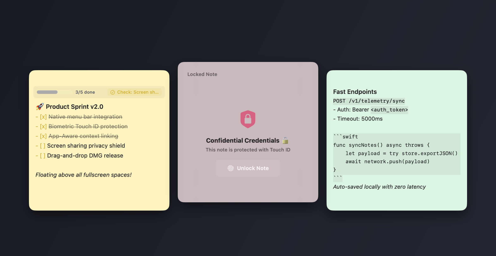
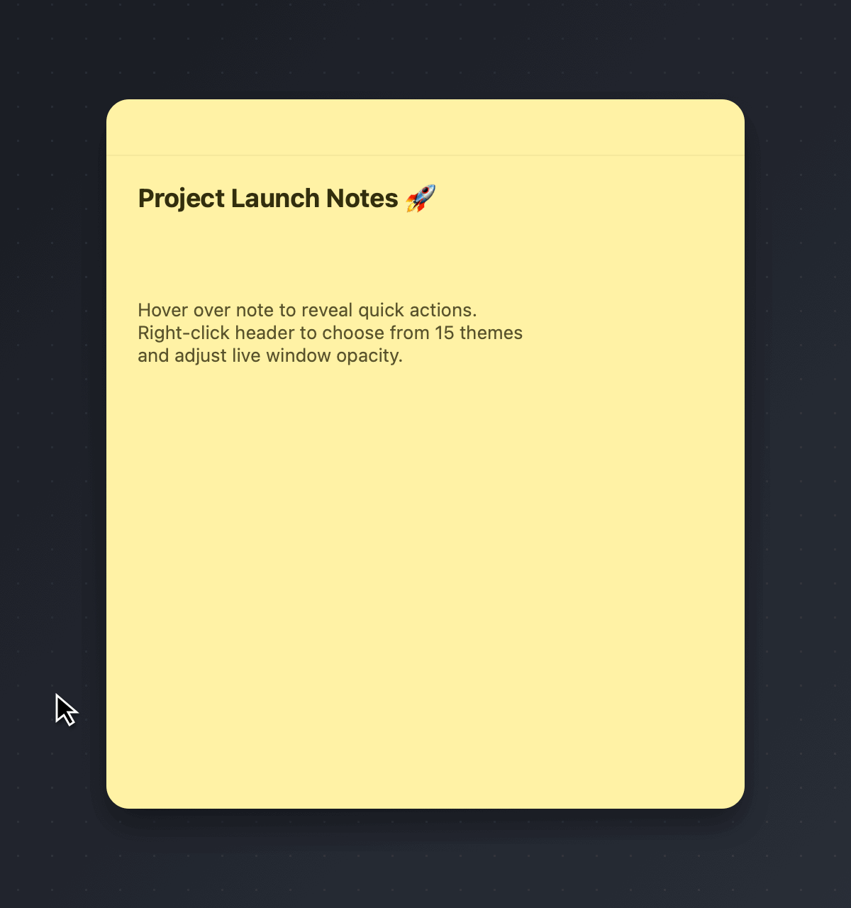
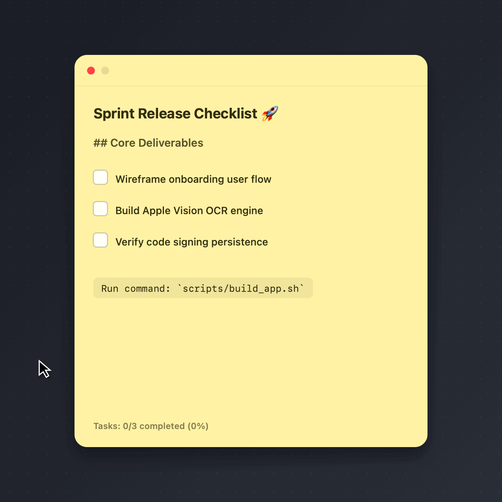
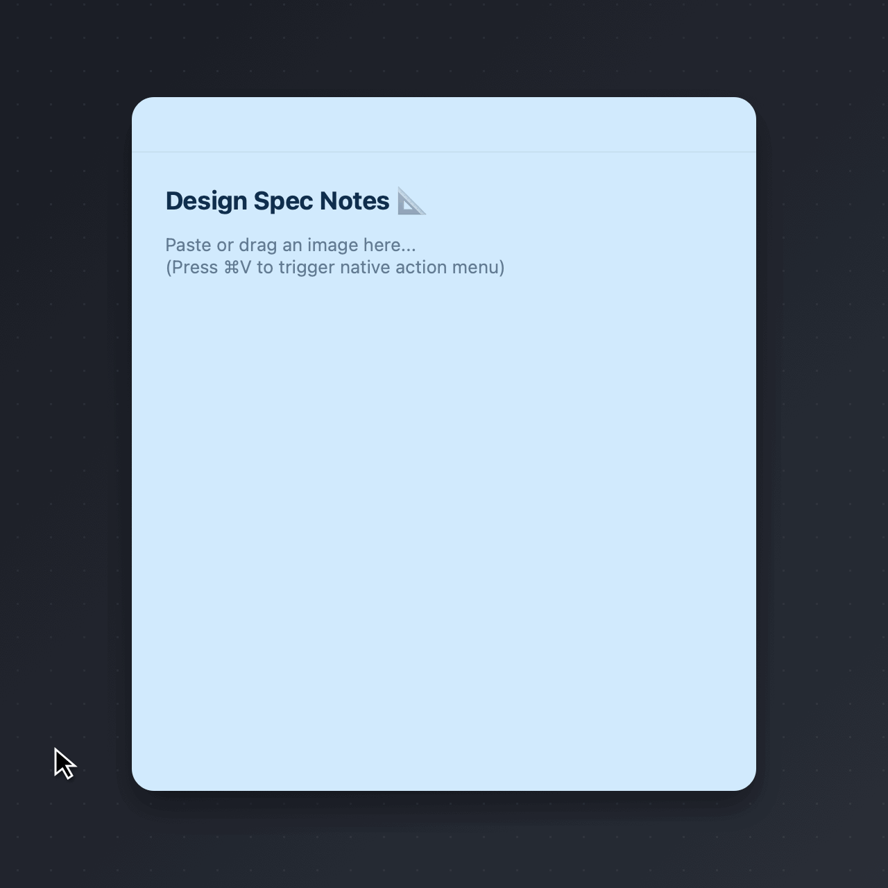
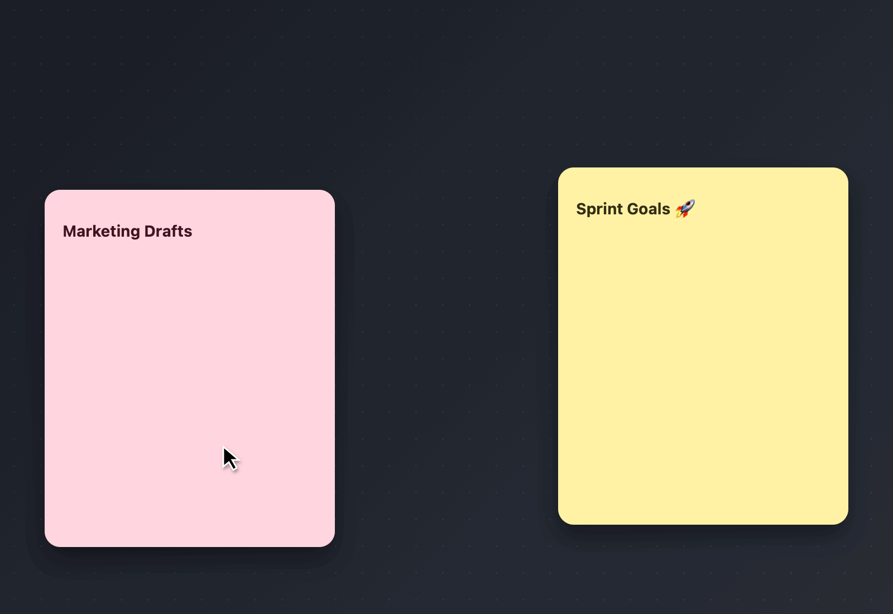
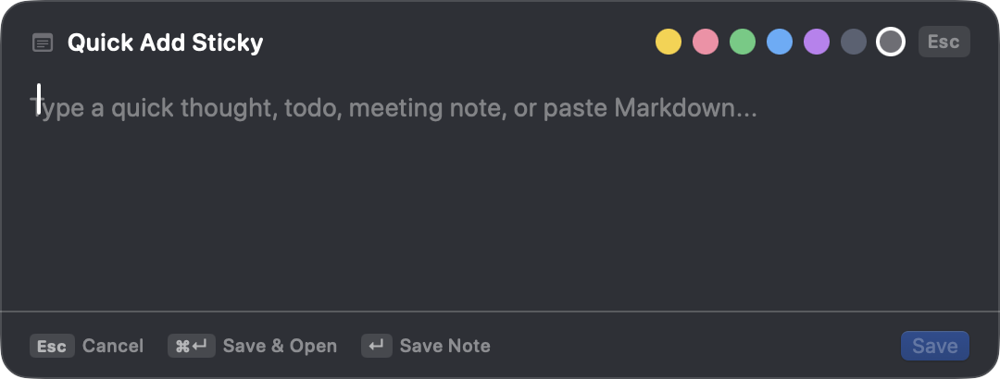
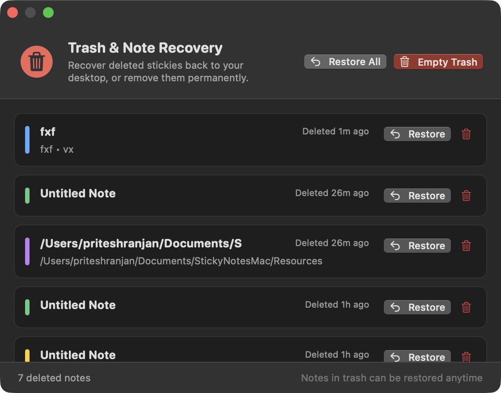
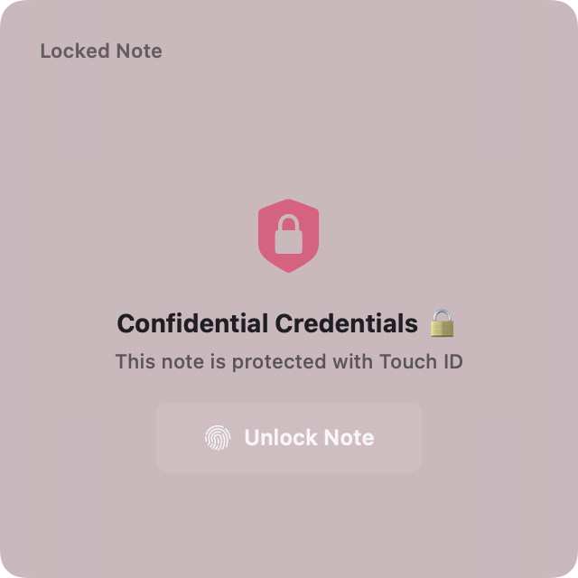
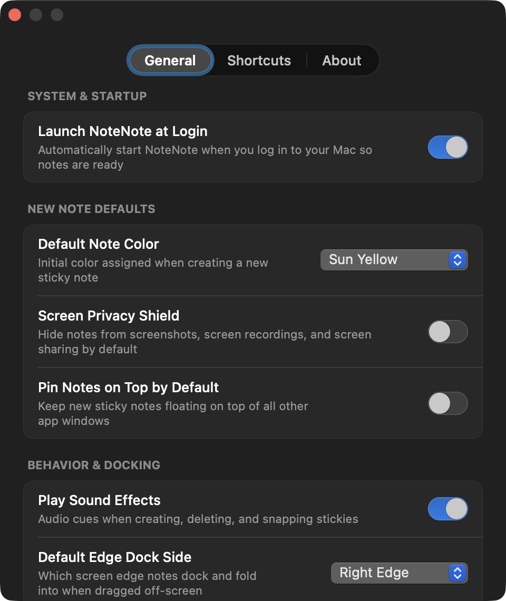

# NoteNote2 — Lightweight, Local-First Sticky Notes for macOS

[](https://www.apple.com/macos/)
[](https://swift.org)
[](LICENSE)
[](https://github.com/pritesh-ranjan/NoteNote2/actions)
[](https://github.com/pritesh-ranjan/NoteNote2/releases/latest)

**NoteNote2** is a fast, open-source, privacy-focused sticky notes app for macOS built natively with **Swift**, **SwiftUI**, and **AppKit**. It is designed for developers, designers, and power users who want floating, distraction-free desktop stickies without Electron overhead, accounts, or cloud lock-in.

Lives in your **menu bar** with zero Dock clutter, stays floating over fullscreen apps, renders **live Markdown with interactive checklists**, and stores everything **100% locally** on your Mac.

<p align="center">
  
</p>

---

## Download & Install

<p align="center">
  <a href="https://github.com/pritesh-ranjan/NoteNote2/releases/latest/download/NoteNote.dmg">
    
  </a>
</p>

1. Download **[NoteNote.dmg](https://github.com/pritesh-ranjan/NoteNote2/releases/latest/download/NoteNote.dmg)**.
2. Drag `NoteNote.app` into your **Applications** folder.
3. Launch NoteNote — it appears in your **menu bar** ready to use.

> **Requires macOS Sonoma 14.0 or later.**

---

## Key Features

- 📸 **Capture Screen as Sticky (`⌘⌥S`)** — Select any screen region with macOS's native interactive crosshairs; instantly spawns a new sticky note with the screenshot attached and focused for immediate typing.
- 🖼️ **Image Attachments & macOS Preview** — Drag & drop or paste images into any note. A clean, compact thumbnail strip keeps your notes neat. Click any thumbnail to view full-size in macOS Preview.
- 🤖 **On-Device Apple Vision OCR** — Drag, paste, or right-click images and choose **Paste Image Text (Vision OCR)** to extract text locally using Apple's Neural Engine. Zero cloud pings, 100% private.
- 📤 **Save As & Export (PDF, Markdown, Plain Text)** — Right-click any note body to export directly to formatted `.pdf`, `.md`, or `.txt` files with one click.
- 🖐️ **Trackpad Gestures & Note Cycling** — Pull down anywhere in an active note to open Search; swipe left/right (or press `⌘]` / `⌘[`) to smoothly cycle through stickies with haptic feedback and an active index badge.
- 🔎 **Spotlight Search HUD** — Floating overlay to instantly search note titles, markdown body, checklist items, colors, and linked apps. Navigate with `↑`/`↓` and press `↵` to jump directly to any note.
- ⚡ **Spotlight Quick Add (`⌘⇧N`)** — System-wide quick capture HUD accessible from any application.
- ↩️ **Trash & Note Recovery** — Soft-delete safety net. Reopen deleted stickies from the menu bar and restore them to their exact previous screen position with one click.
- 🎨 **15 Color Themes & Paper Patterns** — 7 classic sticky pastels plus 8 designer themes with textured paper patterns (dots, grid, margin guides, stripes) and real-time transparency preview (20%–100%).
- 📝 **Live Markdown & Interactive Checklists** — Clickable checkboxes (`- [ ]` / `- [x]`), headers, code chips, bold/italic formatting, and word counters.
- 📌 **Always on Top Across Spaces** — Floats above standard windows and remains accessible even when applications enter fullscreen mode.
- 🔗 **App-Aware Context Linking** — Attach notes to specific Mac apps (e.g. Figma, Slack, Xcode); stickies automatically show when that app is active.
- 🛡️ **Screen Sharing Privacy Shield** — One-click protection (`window.sharingType = .none`) to keep private notes hidden during screen shares and recordings.
- 🔒 **Touch ID / Biometric Lock** — Lock sensitive stickies behind a frosted glass shield, unlocked via Touch ID or system passcode.
- ⭲ **Edge Dock** — Dock notes to screen edges as compact tabs to keep your workspace tidy.
- 💾 **100% Local & Reinstall-Safe** — Stored in `~/Library/Application Support/NoteNote/` with automated backup snapshots. Survives app reinstalls.

---

## Screenshots & Interactive Demos

<table>
  <tr>
    <td width="50%" align="center">
      <b>Popping & Hiding Header Menu</b><br>
      <sub>Hover to reveal action buttons; right-click for 15 themes & opacity</sub><br><br>
      
    </td>
    <td width="50%" align="center">
      <b>Interactive Checklists & Markdown</b><br>
      <sub>Clickable checkboxes, live progress counter & formatted code</sub><br><br>
      
    </td>
  </tr>
  <tr>
    <td width="50%" align="center">
      <b>Image Paste & On-Device Vision OCR</b><br>
      <sub>⌘V or drag images, extract text locally with zero cloud pings</sub><br><br>
      
    </td>
    <td width="50%" align="center">
      <b>Global Note Search (Spotlight HUD)</b><br>
      <sub>Instant search across notes, checklists & linked apps</sub><br><br>
      
    </td>
  </tr>
  <tr>
    <td width="50%" align="center">
      <b>Spotlight Quick Add (⌘⇧N)</b><br>
      <sub>Instant HUD capture anywhere across macOS</sub><br><br>
      
    </td>
    <td width="50%" align="center">
      <b>Trash & Note Recovery</b><br>
      <sub>One-click restore to original desktop coordinates</sub><br><br>
      
    </td>
  </tr>
  <tr>
    <td width="50%" align="center">
      <b>Touch ID Biometric Lock</b><br>
      <sub>Frosted privacy shield unlocked with Touch ID</sub><br><br>
      
    </td>
    <td width="50%" align="center">
      <b>Native Preferences</b><br>
      <sub>Startup options, screen privacy, sounds & storage</sub><br><br>
      
    </td>
  </tr>
</table>

---

## Shortcuts & Gestures

| Shortcut / Gesture | Action | Scope |
| :--- | :--- | :--- |
| `⌘ P` | **Pin / Unpin (Always on Top)** | Active Note Window |
| `⌘ L` | **Lock / Unlock (Touch ID)** | Active Note Window |
| `Swipe from Up` *(or 3-finger down)* | **Open Spotlight Search HUD** | Active Note Window |
| `Swipe Left` / `Swipe Right` | **Next / Previous Sticky Note** | Active Note Window |

---

## Build from Source

```bash
# Clone repository
git clone https://github.com/pritesh-ranjan/NoteNote2.git
cd NoteNote2

# Compile and launch NoteNote.app
make run

# Build a styled DMG installer
make dmg
```

| Command | Action |
| :--- | :--- |
| `make` / `make build` | Compile and bundle `NoteNote.app` |
| `make run` | Build and launch the app immediately |
| `make dmg` | Generate a styled drag-and-drop installer `NoteNote.dmg` |
| `make clean` | Clean build artifacts and cached binaries |

---

## Architecture & Storage

### Storage Location
Notes and preferences are stored strictly offline on your Mac:

```
~/Library/Application Support/NoteNote/
├── notes.json          # Active sticky notes
├── notes.backup.json   # Automatic redundant backup snapshot
├── trash.json          # Preserved deleted notes for recovery
├── settings.json       # User preferences
└── attachments/        # Embedded image attachments by note UUID
```

- **Reinstall-Safe**: Stored in `~/Library/Application Support/`, keeping your notes intact when upgrading or reinstalling `NoteNote.app`.
- **Zero Telemetry**: No analytics, background pings, or network calls.
- **Finder Access**: Open **Preferences > Data & Storage** and click **"Reveal in Finder"** to view or back up your files at any time.

### Codebase Overview
```
NoteNote2/
├── Sources/NoteNoteApp/
│   ├── Models/         # NoteModel (paper patterns, attachments), NoteColor (15 themes), AppSettings
│   ├── Services/       # NotesStore (atomic JSON), ScreenCaptureService, VisionOCRService, NoteExportService, GestureController, HotkeyService, TouchIDService
│   ├── Windows/        # StickyPanel, SpotlightHUDPanel (squircle HUD), MenuBarController, WindowControllers
│   ├── Views/          # StickyNoteView, NoteEditorView, NoteAttachmentStripView, PaperPatternView, NoteContextMenu, SearchNotesView, TrashView
│   └── Utilities/      # VisualEffectView (squircle blur mask), WindowDragArea, MarkdownRenderer
├── scripts/            # build_app.sh (stable designated requirement codesign), build_dmg.sh
└── Makefile            # Build, run, and DMG packaging targets
```

---

## Frequently Asked Questions

<details>
<summary><b>Does NoteNote2 require an internet connection?</b></summary>
<br>
No. NoteNote2 is 100% offline and local-first. It makes zero network calls and stores all notes locally on your Mac.
</details>

<details>
<summary><b>How does Screen Capture work and will it prompt for permissions every time?</b></summary>
<br>
Pressing <code>⌘⌥S</code> invokes macOS's native interactive screen selection. Once you select a region, NoteNote2 immediately saves the screenshot into your local attachments folder, opens a new sticky note with the image attached, and auto-focuses the text editor for instant typing. Because NoteNote2 is signed with a stable designated requirement identifier (<code>com.priteshranjan.NoteNote</code>), macOS permanently remembers your Screen Recording permission once granted in <b>System Settings > Privacy & Security > Screen Recording</b> without prompting on restarts.
</details>

<details>
<summary><b>How does image attachment and Vision OCR work?</b></summary>
<br>
When you drag an image or press <code>⌘V</code> with an image on your clipboard, NoteNote2 displays a native popup menu allowing you to attach the image or extract text using macOS's built-in Apple Vision framework. OCR runs entirely on-device via Apple Silicon Neural Engine with zero network requests. Attached images are saved locally in your NoteNote application support directory and can be opened in macOS Preview by clicking their thumbnail.
</details>

<details>
<summary><b>How do I export my notes?</b></summary>
<br>
Right-click anywhere on a note body and select <b>Save As...</b> to export to formatted <b>PDF Document (.pdf)</b>, <b>Markdown File (.md)</b>, or <b>Plain Text (.txt)</b>.
</details>

<details>
<summary><b>What happens to my notes when I update or reinstall?</b></summary>
<br>
Your notes are completely safe. Notes and trash live in <code>~/Library/Application Support/NoteNote/</code>, which macOS leaves untouched when updating or replacing the application bundle in <code>/Applications</code>.
</details>

<details>
<summary><b>Can I recover accidentally deleted notes?</b></summary>
<br>
Yes. NoteNote2 includes a soft-delete safety net. Select <b>Trash & Recovery</b> from the menu bar to preview deleted notes and restore them to their original desktop positions with a single click.
</details>

<details>
<summary><b>How does the Screen Sharing Privacy Shield work?</b></summary>
<br>
Toggling the Privacy Shield (🛡️) on a note marks its window with <code>window.sharingType = .none</code>, instructing macOS to omit the window from standard window capture and screen sharing sessions while remaining visible to you.
</details>

<details>
<summary><b>Does Touch ID encrypt my notes on disk?</b></summary>
<br>
Touch ID acts as an on-screen UI privacy shield against shoulder-surfing. Notes are saved locally as plain JSON for fast indexing and performance. For full disk encryption, enable macOS FileVault.
</details>

---

## Contributing & License

Contributions are welcome! Please see [CONTRIBUTING.md](CONTRIBUTING.md) for details.

Distributed under the [MIT License](LICENSE). Free for personal and commercial use.

Made with ❤️ by [Pritesh Ranjan](https://github.com/pritesh-ranjan).
